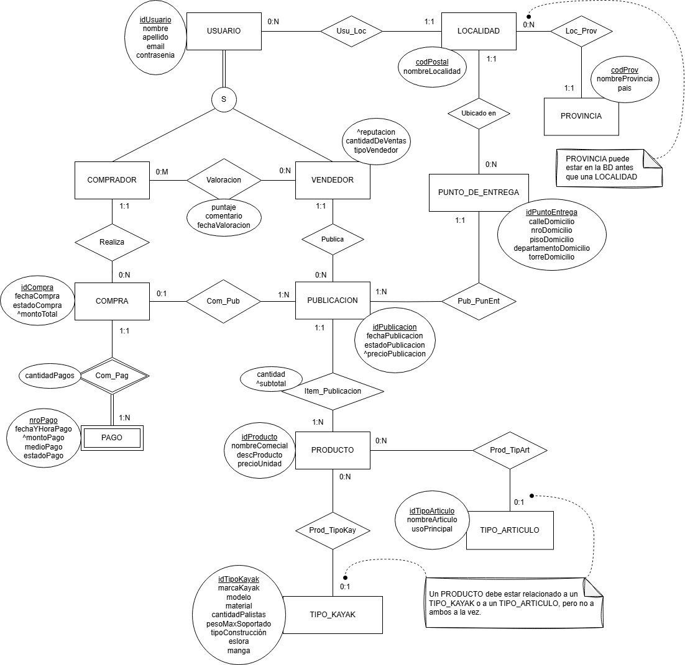

# Propuesta TP DSW

## Grupo
### Integrantes
* 52077 – Boveri, Rafaela
* 52280 – Cardelli, Lázaro
* 50258 – Martina, Santiago
* 51191 – Mateo, Alexis

### Repositorios
* [frontend app](https://github.com/AlexisMateo02/tp_frontend_dsw)
* [backend app](https://github.com/AlexisMateo02/tp_backend_dsw)

## Tema
### Descripción
*El sistema a desarrollar será una plataforma web para la compra y venta de productos náuticos usados, como kayaks, remos y accesorios.
Los usuarios podrán registrarse, realizar compras, gestionar entregas y dejar valoraciones de nuestros productos.
En paralelo, la plataforma ofrecerá un foro de ventas en donde los usuarios podrán realizar publicaciones, en el cual otros usuarios se podrán contactar con los vendedores si les interesa.*

### Diagrama de Entidad-Relación

## Alcance Funcional 

### Alcance Mínimo

Regularidad
|Req|Detalle|
|:-|:-|
|CRUD simple|1. CRUD Tipo_Kayak 2. CRUD Tipo_Articulo 3. CRUD Localidad 4. CRUD Provincia|
|CRUD dependiente|1. CRUD Producto {depende de} Tipo_Kayak / Tipo_Articulo 2. CRUD Usuario (Comprador/Vendedor) {depende de} Localidad|
|Listado + detalle| 1. Listado de publicaciones filtrado por estado (activa, vendida) => detalle muestra productos, precio total y punto de entrega  2. Listado de productos filtrado por tipo => detalle muestra descripción y datos técnicos|
|CUU/Epic|1. Publicar productos para la venta (gestión completa de una publicación) 2. Realizar una compra (selección de publicaciones + pago)|

Adicionales para Aprobación
|Req|Detalle|
|:-|:-|
|CRUD |1. CRUD Tipo_Kayak 2. CRUD Tipo_Articulo 3. CRUD Localidad 4. CRUD Provincia 5. CRUD Producto 6. CRUD Punto_Entrega 7. CRUD Usuario (Comprador/Vendedor)|
|CUU/Epic|1. Publicar productos para la venta 2. Realizar una compra  mediante múltiples pagos 3. Valorar a un vendedor 4. Consultar el historial de compras y ventas realizadas 5. Gestionar publicaciones existentes, incluyendo modificación 6. Consultar pagos realizados en compras|

### Alcance Adicional Voluntario

|Req|Detalle|
|:-|:-|
|Listados |1. Historial de compras de un comprador con filtros por fecha y estado 2. Ventas realizadas por un vendedor con detalle de publicaciones y puntos de entrega|
|CUU/Epic|1. Edición de publicaciones (solo si están activas) 2.  Cancelar una compra pendiente|
|Otros|1. Envío de notificación por email al concretar una compra|
